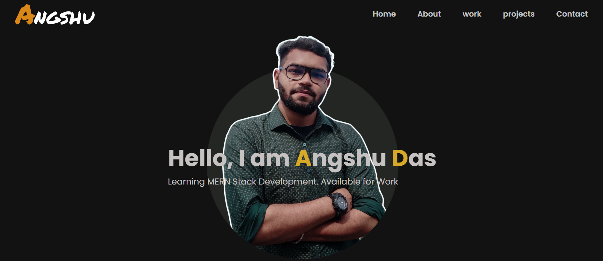
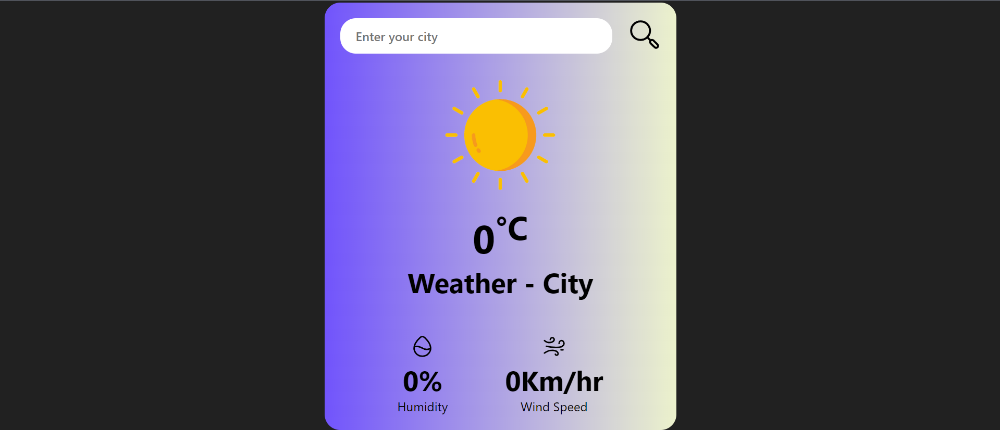
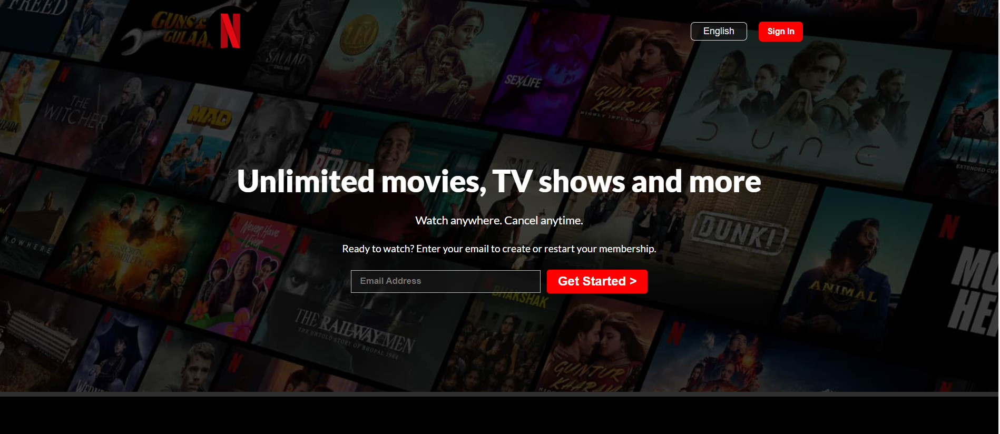

# Bharat Intern
Welcome to my internship repository! Here, I share my progress and projects as a web development intern at BharatIntern. Dive in to see how I'm honing my skills in HTML, CSS, JavaScript, and more. 

## Task-1 (Portfolio Website)

At Bharat Intern, Task 1 involves creating my personal portfolio website using HTML, CSS, and JavaScript. It's all about showing off what I can do in a cool and easy-to-use website. I'll design how it looks, make sure it works well on phones and computers, and add some fun stuff with JavaScript. Here, I showcase my recent projects, share my latest learnings, and provide links to my social profiles. You can explore my projects with live demos and view their source code. If you'd like to get in touch, feel free to send me a message through the contact form, which securely saves messages to a Google Sheet for my review. Thank you for visiting!

## Task-2 (Weather Website)

Task 2 at Bharat Intern involves creating a weather website that displays temperature, humidity, and wind speed using data fetched from the OpenWeather API. This project aims to provide users with accurate and up-to-date weather information in a user-friendly format. By utilizing the OpenWeather API, I'll be able to retrieve real-time data and present it dynamically on the website. Through this task, I'll gain experience in integrating APIs into web applications and enhance my skills in front-end web development.

## Task-3 (Netflix home page)

Task 3 at Bharat Intern involves designing a Netflix homepage using only HTML and CSS. This project aims to replicate the user interface of the Netflix homepage, demonstrating proficiency in front-end web development.